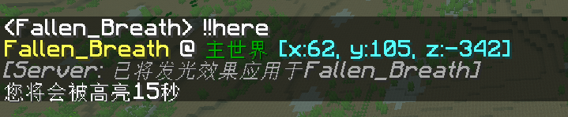

Here
-------

一个 [MCDReforged](https://github.com/Fallen-Breath/MCDReforged) 的插件

适用版本：1.13 以上服务器

可搭配 <a href="https://github.com/tanhHeng/AutoBOTPrefix">AutoBOTPrefix 自动添加BOT前缀</a> 使用

## 命令(NEW)

`!!here`：显示玩家坐标并使其发光

`!!vris <player>`：显示玩家<player>的坐标并使其发光 **(NEW)**

## 修复(FIXED)

以下修复内容皆相对于WhereIs插件 https://github.com/Lazy-Bing-Server/WhereIs-MCDR/releases ，且仅限不开启rcon（未测试开启rcon）

- 修复了当使用`!!vris`功能时，如果被查询的玩家(假人)带有"[BOT]"前缀 *(如[BOT]bot_sleep)*，无法正常查询并高亮的问题

- 修复了高亮坐标点时，出现/execute指令的问题

## 配置文件

部分特性可由配置文件控制，默认自动生成于 `config/here.json`。

修改配置文件之后需要使用`!!MCDR plg reload here`重载方可生效。

`highlight_time`：整数，控制玩家是否高亮（0 即为不高亮）及高亮时长；

`display_voxel_waypoint`：布尔值，为真则显示一小段文本（`[+V]`），点击以高亮坐标，Ctrl+点击以添加坐标点至 [Voxelmap](https://www.curseforge.com/minecraft/mc-mods/voxelmap)；

`display_xaero_waypoint`：布尔值，为真则显示一小段文本（`[+X]`），点击以添加坐标点至 [Xaero's Minimap](https://chocolateminecraft.com/minimap2.php)；

`click_to_teleport`：布尔值，为真则允许玩家点击坐标以传送到对应位置（实为放置传送命令至聊天栏，玩家回车执行，以避免非OP传送、意外传送等问题）

## RCON

当 MCDR 启动 rcon 时，此插件可使用 rcon 来获得玩家信息，响应更快。

## 效果(NEW)

