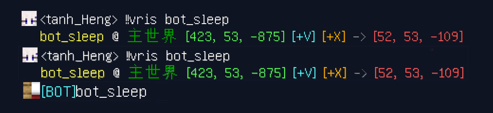

Here
-------

一个 [MCDReforged](https://github.com/Fallen-Breath/MCDReforged) 的插件

当玩家输入 `!!here` 时，玩家的坐标将被显示并且将被发光效果高亮

部分特性可由配置文件控制，配置文件默认位置`config/here.json`，加载一次后会自动生成, 修改配置文件之后需要使用`!!MCDR plg reload here`重载后生效

调整配置文件中的 `"highlight_time"` 即可控制玩家是否高亮(0即为不高亮)，以及自定义高亮的时长

将配置文件中的`"display_voxel_waypoint"`设为`true`以显示一小段含点击事件的文本，点击以高亮坐标，ctrl点击以添加坐标点至Voxelmap

或`"display_xaero_waypoint"`设置为`true`以显示一小段含点击事件的文本，点击以添加坐标点至Xaero's Minimap

将配置文件中的`"click_to_teleport"`设为`true`以使显示的坐标可以让玩家点击传送到该位置（实为补全完整的传送命令，由玩家自行执行，以减少或避免非OP传送或意外点击传送等问题）

当 MCDR 启动 rcon 时此插件可使用 rcon 来获得玩家信息，响应更快

